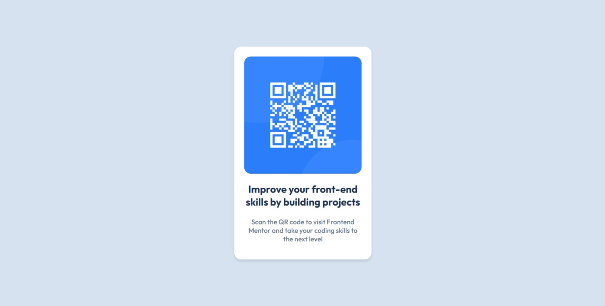

# Frontend Mentor - QR code component solution

This is a solution to the [QR code component challenge on Frontend Mentor](https://www.frontendmentor.io/challenges/qr-code-component-iux_sIO_H). Frontend Mentor challenges help you improve your coding skills by building realistic projects.

## Table of contents

- [Overview](#overview)
  - [Screenshot](#screenshot)
  - [Links](#links)
- [My process](#my-process)
  - [Built with](#built-with)
  - [What I learned](#what-i-learned)
- [Author](#author)

**Note: Delete this note and update the table of contents based on what sections you keep.**

## Overview

### Screenshot

> Desktop Screenshot
> 

> Mobile Screenshot
> 

### Links

- Solution URL: [Find the solution repo](https://github.com/Idrisvohra9/frontend-mentor-qr-card-solution)
- Live Site URL: [Find live site](https://your-live-site-url.com)

## My process

### Built with

- Semantic HTML5 markup
- CSS custom properties
- Flexbox
- Mobile-first workflow

### What I learned

By developing the solution I learned more about working with hsl() color functions.

BTW this is easy level for me.

## Author

- My GitHub Profile- [Idrisvohra9](https://github.com/Idrisvohra9)
- Frontend Mentor - [@Idrisvohra9](https://www.frontendmentor.io/profile/Idrisvohra9)
